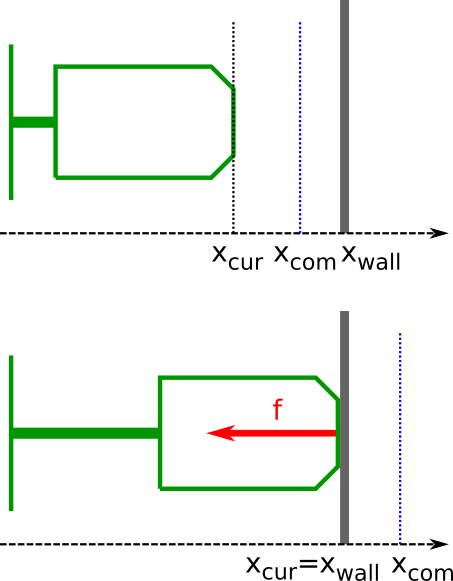

## Principles of force control
Consider a 1-DOF, linear, position-controlled robot as in Fig. 1. One would like to control the contact force f between the robot end-effector and the wall as ${f}={f}_ref$, where f_\mathrm{ref} is, for example, a constant positive value.

 
 
Fig. 1: Contact interaction between a one-dof robot and a wall.

For that, one can use a Proportional-Derivative (PD) control law as in Fig. 2. Note that the command sent to the robot is x_\mathrm{com} is a desired position.

Fig. 2: Block diagram of a force controller to control the contact force between the robot end-effector and the environment. The Laplace variable s stands for differentiation with respect to time (d/dt).

The Force/Torque (F/T) sensor measures the contact force between the end-effector and the wall. When there is no contact (Fig. 1, top sketch), the contact force is zero, thus f_\mathrm{sensed}=0, yielding f_\mathrm{err}>0. Assuming stationary initial conditions, one has next x_\mathrm{err}>0, which implies that x_\mathrm{com}>x_\mathrm{cur}, which in turn makes the robot move to the right, towards the wall.

Upon contact between the robot end-effector and the wall (Fig. 1, bottom sketch), the contact force sensed by the F/T sensor f_\mathrm{sensed} becomes positive, but initially smaller than f_\mathrm{ref} – assuming "soft" collision. Therefore, initially, one still has x_\mathrm{com}>x_\mathrm{cur}=x_\mathrm{wall}, meaning that the robot is commanded to penetrate the wall.

Finally, interactions between the PD controller and the stiffness of the end-effector, of the wall, and of the robot's internal position controller (characterized in part by its own PID gains), will eventually lead to a stationary state where f_\mathrm{err}=0 and x_\mathrm{com}>x_\mathrm{wall} (so as to ensure a positive contact force).
