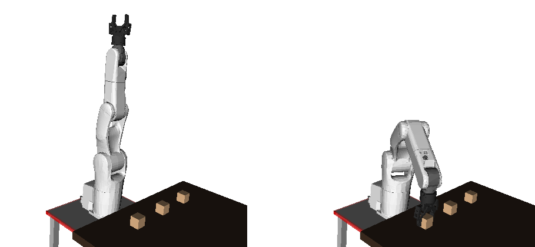



# Motion planning

Consider the task discussed in the Overview of this course: “pick up an
object from the tabletop”.

To properly grasp the object, the gripper must be placed in a
particular position and orientation $$\bfp_\mathrm{des}$$, such as in
the right figure above. In Section [Inverse kinematics], we presented
algorithms to find the *joint angles* $$\bfq^* :=
(\theta_0^*,\dots,\theta_5^*)$$ that achieves the desired gripper
position and orientation.

The *motion planning* problem consists in finding the appropriate
robot commands to move the robot from the starting joint angle
configuration $$\bfq_\mathrm{start}$$ towards the desired goal
configuration $$\bfq_\mathrm{goal}:=\bfq^*$$, while satisfying the
following requirements

1.  avoid collisions between the robot and the environment (the table,
the object to be grasped) or with itself (self-collision)
\[*geometric* or configuration-space constraints\];

2.  respect the robot kinematics and dynamics (kinodynamic)
constraints, such as bounds on joint velocities, accelerations, or
torques \[*kinodynamic* or state-space constraints\];

3.  minimize some criteria, such as execution time or energy
consumption.

We have seen in Section [Inverse kinematics](inverse_kinematics.md)
that the configuration space $$\mathcal{C}$$ of the manipulator is the
set of all possible joint angle values $$\bfq$$. Before proceeding
further, we need some definitions.

> #### Definition::Obstacle and free configuration space
The subset of $$\mathcal{C}$$ that consists of joint angles values
$$\bfq$$ where the robot collides with the environment or with itself
is called the *obstacle space* and denoted
$$\mathcal{C}_\mathrm{obs}$$. The complement of
$$\mathcal{C}_\mathrm{obs}$$ is called the *free space* and denoted
$$\mathcal{C}_\mathrm{free}$$.

  <!-- Intentional line-break to cope with markdown limitations   -->

> #### Definition::Path, time-parameterization, trajectory
Formally, a path in the configuration space can be defined as the
image of a continuous function *P* where
>
$$
\begin{array}{cccl}
P : & [0,L] & \rightarrow  & \mathcal{C} \\
    &   s   & \mapsto      & \bfq(s).
\end{array}
$$
>
A *path* can be regarded as a geometric object devoid of any timing
information. By abuse of notation, we shall refer to $$P$$ as the
path. Next, a *time-parameterization* of $$P$$ is a strictly
increasing function
>
$$
\begin{array}{cccl}
s : & [0,T] & \rightarrow  & [0,L] \\
    &   t   & \mapsto      & s(t),
\end{array}
$$
>
with $$s(0)=0$$ and $$s(T)=L$$. The function $$s$$ gives the position
on the path for each time instant $$t$$. The path $$P$$ endowed with a
time-parameterization becomes a *trajectory*
>
$$
\begin{array}{cccl}
\Pi : & [0,T] & \rightarrow  & \mathcal{C} \\
      &   t  & \mapsto      & \bfq(s(t)),
\end{array}
$$
>
with $$T$$ being the duration of the trajectory. Note that the same path
$$P$$ can give rise to many different trajectories $$\Pi$$.
>

To solve the motion planning problem, we shall adopt the *decoupled
planning* approach: first plan a collision-free *path* that satisfies
the geometric constraints (i.e. a path entirely contained in
$$\mathcal{C}_\mathrm{free}$$). Second, find a *time-parameterization* of
that path to satisfy the kinodynamic constraints, while minimizing
execution time. This pipeline has been found to be the most robust and
efficient motion planning approach, and is therefore widely used in
actual industrial applications. Other approaches, which consists e.g. in
planning directly in the state-space (i.e. the space of joint angles and
joint velocities), have some nice theoretical properties but are rarely
use in practice.

In Section [Path planning](path_planning.md), we discuss methods to
find a collision-free path between $$\bfq_\mathrm{start}$$ and
$$\bfq_\mathrm{goal}$$.

In Section [Time parameterization](time_parameterization.md), we
present methods to find the *time-stamps* for the joint angles along
the path, so as to satisfy bounds on velocity, acceleration or torques
while optimizing execution time.

In Section [Post-processing](post_processing.md), we study some
methods to further improve the quality of trajectories found in the
previous steps, in terms of execution time or trajectory smoothness.
