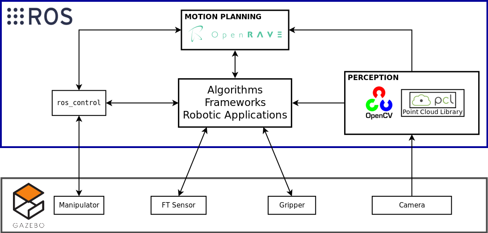

# System

Putting together the different hardware components of a robotic system
requires a versatile and robust software architecture.

In this course, we propose an architecture that runs on top of the
Robot Operating System (ROS). This allows us to conveniently integrate
all the tools discussed in the previous chapters such as OpenRAVE,
OpenCV and the Point Cloud Library (PCL).

Figure 5 shows a representation of the software architecture. The
simulation of the hardware components is done using **Gazebo**. It is
a multi-robot simulator in a 3-dimensional world, with a robust
physics engine, high-quality graphics, and convenient programmatic and
graphical interfaces. It comes with advanced plugin-interfaces that
can be used to simulate the sensors feedback and plausible
interactions between objects.

For the propose of this course, we will be simulating the following
components in Gazebo:

1. Industrial manipulator: Denso VS-060
2. Parallel-jaw gripper: Robotiq 85 Gripper
3. Generic force/torque sensor
4. Generic 3D camera
